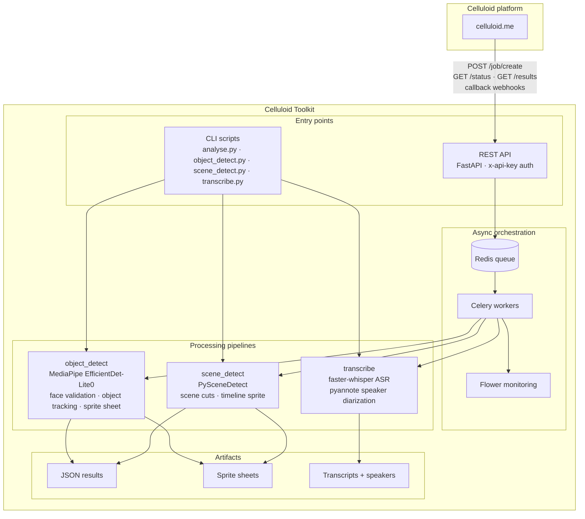

# Celluloid Toolkit

Celluloid Toolkit is a collection of tools for video detection and analysis, transcription, diarization and more.
Project used in [Celluloid platform](https://celluloid.me).

## Features



| Pipeline | Engine | Output |
|----------|--------|--------|
| `object_detect` | MediaPipe (EfficientDet-Lite0) + custom tracker | Per-frame detections, tracked objects, sprite sheet |
| `scene_detect` | PySceneDetect (content + threshold detectors) | Scene list with timestamps, optional scene sprite |
| `transcribe` | faster-whisper (CPU INT8) + pyannote 3.1 | Timestamped transcript, speaker labels, word timings |

## Installation

**Prerequisites**: Python 3.12 is required (MediaPipe doesn't support Python
3.13+ yet).

1. **Install uv** (if not already installed):
   ```bash
   curl -LsSf https://astral.sh/uv/install.sh | sh
   ```

2. **Install Python 3.12** (if not already installed):
   ```bash
   # macOS (using Homebrew)
   brew install python@3.12

   # Or let uv install it automatically (recommended)
   uv python install 3.12
   ```

3. **Install Python Dependencies**:
   ```bash
   uv pip install -e .
   ```

   Or using a virtual environment with Python 3.12:
   ```bash
   uv venv --python 3.12
   source .venv/bin/activate  # On Windows: .venv\Scripts\activate
   uv pip install -e .
   ```

4. **Ensure MediaPipe Models**: The service will automatically download required
   models on first use.

## Usage

### Option 1: Command-Line Video Analysis (Recommended for Single Files)

Run video analysis directly using Python without starting the API server:

```bash
# Basic usage
python analyse.py path/to/video.mp4

# Or with a video URL
python analyse.py https://example.com/video.mp4

# With custom output file
python analyse.py video.mp4 --output results.json

# With custom confidence threshold
python analyse.py video.mp4 --min-score 0.9

# With custom similarity threshold for tracking
python analyse.py video.mp4 --similarity-threshold 0.7

# Combine options
python analyse.py video.mp4 --output results.json --min-score 0.85 --similarity-threshold 0.6
```

**Available Options:**
- `--output`, `-o`: Output JSON file path (default: `detections.json`)
- `--min-score`, `-s`: Minimum confidence score for detections, 0.0 to 1.0 (default: `0.8`)
- `--similarity-threshold`: Similarity threshold for object tracking, 0.0 to 1.0 (default: `0.5`)

The script will:
- Download the video if a URL is provided
- Process each frame for object detection
- Track objects across frames
- Generate a sprite sheet of detected objects
- Save results to a JSON file with metadata

### Option 2: API Server (for Multiple Jobs and Queuing)

Start the FastAPI web service for processing multiple videos with job queuing:

#### Using uv run (Recommended)

Run directly with uv. It will automatically use Python 3.12 as specified in
`pyproject.toml`:

```bash
uv run python run.py api
```

If you need to explicitly specify Python 3.12:

```bash
uv run --python 3.12 python run.py api
```

The service will start on `http://localhost:8081`

### Celery Monitoring (Flower)

Run Flower to monitor Celery workers, tasks, and queues:

```bash
uv run python run.py flower
```

Flower will be available at `http://localhost:5555` (or `FLOWER_PORT`).

### Run API + Worker + Flower

Run all three services in one process group:

```bash
uv run python run.py all
```
